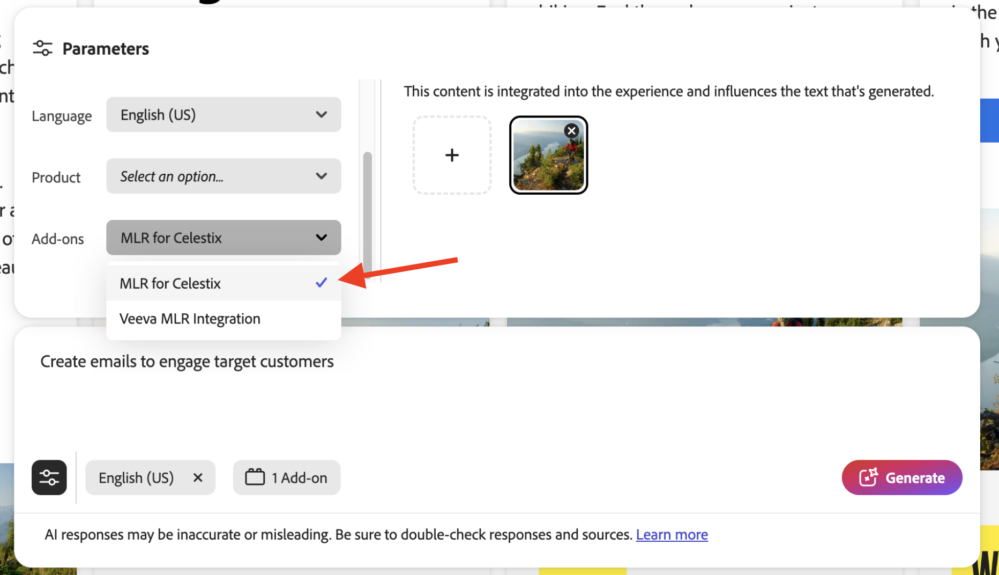
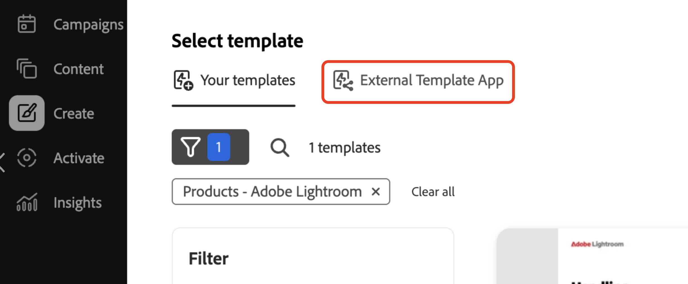

# Implante seu aplicativo

A execução do aplicativo oferece um instantâneo preliminar do comportamento do complemento antes de implantá-lo. Isso pode ajudar na depuração.

## Executar o aplicativo

Executar o aplicativo em `https://localhost:9080`:

```bash
aio app run
```

## Implantar o aplicativo

1. Navegue até o espaço de trabalho Implantação:

   ```bash
   aio app use -w [deployment_workspace]
   ```

2. Implante o aplicativo:

   ```bash
   aio app deploy
   ```

## Forçar reimplantação

Você pode forçar uma criação e implantação do seu aplicativo sem reenviá-lo para aprovação.

>[!NOTE]
>
>Forçar uma criação e implantação substitui a implantação existente. **Primeiro teste completamente seu aplicativo** em um ambiente de teste.

```bash
aio app build --force-build
```

```bash
aio app deploy --force-deploy
```

## Criar e implantar simultaneamente

```bash
aio app deploy --force-build --force-deploy
```

## Encontre seu novo aplicativo

Após a implantação, é possível visualizar o novo aplicativo no GenStudio for Performance Marketing.

### Visualizar com um URL

Veja o novo aplicativo adicionando um parâmetro `query` à URL do GenStudio for Performance Marketing:

```txt
https://experience.adobe.com/?ext=https://<my-deployed-add-on>.adobeio-static.net/index.html#/@<ims-org>/genstudio/create
```

### Exibir na interface

Novas extensões são encontradas em diferentes locais na interface do usuário, dependendo do tipo de extensão implantada. Os pontos de extensão disponíveis no momento são:

* Extensão de conformidade, que inclui:
   * [*pontos de extensão de prompt*](#find-prompt-extensions), que permitem aos clientes adicionar contexto adicional à geração de LLM e
   * [*pontos de extensão de validação*](#find-validation-extensions), que permitem aos clientes validar o conteúdo gerado do LLM. A validação geralmente é combinada com a extensão Prompt para garantir que o conteúdo gerado com um prompt estendido esteja de acordo com as exigências do cliente (por exemplo, solicitações de medicamentos ou informações legais)
* [Extensão do Gerenciamento de ativos digitais (DAM)](#find-dam-extensions)
* [Extensão do modelo](#find-template-extensions)
* [Extensão de tradução](#find-translation-extensions)

### Localizar extensões de prompt

Extensões de prompt são encontradas na lista suspensa **Complementos**, na **seção de parâmetros** de um modelo.

{width="600" zoomable="yes"}

A caixa de diálogo complementar será aberta, permitindo selecionar o contexto adicional a ser adicionado para a geração do LLM.

{width="600" zoomable="yes"}

### Localizar extensões de validação

As extensões de validação podem ser encontradas após uma geração de prompt, no lado direito exibido com os resultados.

{width="600" zoomable="yes"}

Execute a extensão selecionada para validar o conteúdo gerado.

{width="600" zoomable="yes"}

Quando houver erros, você poderá usar a extensão para atualizar a cópia das experiências de forma programática. Clicar no botão **[!UICONTROL Copiar]** copiará o texto sugerido para a área de transferência. O botão **[!UICONTROL Aplicar]** aplicará o texto a uma caixa de texto específica na experiência gerada.

{width="600" zoomable="yes"}

### Localizar extensões DAM

As extensões do Gerenciamento de Ativos Digitais (DAM) são encontradas ao selecionar o conteúdo na **seção de parâmetros** de um modelo. Consulte a parte inferior da lista suspensa **Selecionar local** para ver complementos.

{width="600" zoomable="yes"}

### Localizar extensões de modelo

As extensões de modelo são encontradas na guia **Aplicativo de modelo externo** ao selecionar um modelo. Esta guia aparece somente quando há aplicativos de modelo a serem selecionados.

{width="600" zoomable="yes"}


### Localizar extensões de tradução

Use Pontos de extensão de tradução para trazer seu próprio serviço de tradução por meio de um proxy, em vez de usar a tradução padrão do GenStudio.
Não há local na interface do usuário para essas extensões.

Se a extensão for registrada, o serviço de tradução fornecido será usado. Caso contrário, o serviço de tradução padrão do GenStudio será usado.


Se estiver satisfeito com o Complemento, você estará pronto para distribuí-lo sem o parâmetro `query`.

Agora você pode [distribuir seu aplicativo](distribute-app.md).
