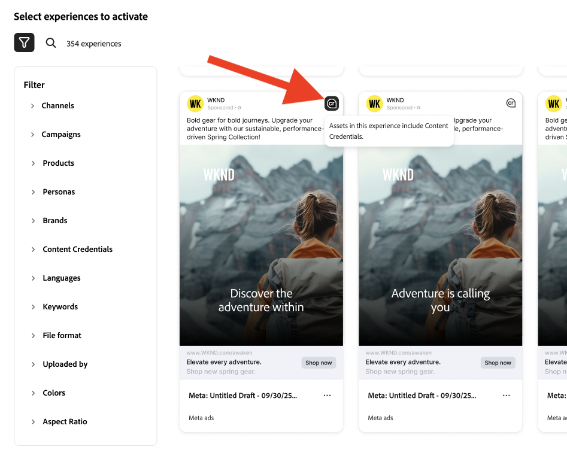

# Content Credentials para organizações

Saiba como as credenciais à prova de adulteração para conteúdo que comprovam a autenticidade da marca e impulsionam a conformidade são incorporadas diretamente em seu fluxo de trabalho de marketing.

>[!WARNING]
>
> No momento, esse recurso está na versão beta e só está disponível para organizações que receberam acesso. Se estiver interessado, entre em contato com o representante da equipe de contas da Adobe ou [use este link para solicitar a inscrição](https://www.feedbackprogram.adobe.com/c/a/5aWPEOthrDv22Mf9CyekOy?source=qr).

## Introdução ao Content Credentials

Depois que o Content Credentials for ativado na Admin Console, os usuários da GenStudio for Performance Marketing poderão ativar o Content Credentials para todos os ativos globalmente no aplicativo. Se a opção global para aplicar credenciais estiver desativada, os usuários terão a opção de aplicar o Content Credentials para cada ativo individual.

Quando o conteúdo for publicado, o Content Credentials estará visível nas plataformas externas, como o LinkedIn.

Os administradores são responsáveis por fazer upload de um certificado X.509 válido no Admin Console. Esta etapa garante que a assinatura digital da empresa esteja configurada corretamente e pronta para uso nos aplicativos Adobe DX suportados.

>[!NOTE]
>
>O controle sobre essa configuração pode mudar para a Admin Console no futuro, simplificando o gerenciamento do Content Credentials entre aplicativos e melhorando a supervisão administrativa.

## O que são Content Credentials? 

Content Credentials são um tipo de metadados durável e padrão do setor, com detalhes sobre como o conteúdo foi feito e informações de identidade sobre os criadores. O Content Credentials pode ser visualizado quando o conteúdo é publicado online em plataformas de suporte ou usando ferramentas como a [ferramenta Inspect da Adobe](https://contentauthenticity.adobe.com/inspect) ou a [extensão de navegador Adobe Content Authenticity Chrome](https://helpx.adobe.com/creative-cloud/help/cai/adobe-content-authenticity-chrome-browser-extension.html).  

A aplicação do Content Credentials pode ajudar a aumentar a transparência sobre como o conteúdo foi feito e pode ajudar seus usuários a se conectarem ao conteúdo.

[Saiba mais sobre o Content Credentials](https://helpx.adobe.com/creative-cloud/help/content-credentials.html) na Adobe.

## Assinatura da marca e rastreamento de ativos

O conteúdo assinado pela marca desempenha um papel significativo na promoção da integridade da marca e da confiança do usuário. As organizações podem assinar seu conteúdo com uma assinatura de marca exclusiva nos aplicativos da Adobe quando o certificado estiver configurado corretamente na Admin Console. Essa garantia de autenticidade é mantida usando tecnologias invisíveis de marca d&#39;água e impressão digital, que ajudam a preservar a durabilidade da assinatura durante todo o ciclo de vida do conteúdo.

Além da assinatura da marca, as empresas podem anexar IDs de ativos diretamente ao seu conteúdo. Isso facilita o rastreamento eficiente de ativos, especialmente quando compartilhados ou publicados em plataformas de redes sociais. Incorporando IDs de ativos, as organizações podem rastrear a origem e o caminho de distribuição de seu conteúdo, melhorando a supervisão e a responsabilidade.

## Content Credentials no fluxo de trabalho de marketing

A aplicação do Content Credentials pode ser feita em todo o fluxo de trabalho de marketing diretamente no GenStudio for Performance Marketing, desde a importação e a descoberta de conteúdo até a ativação e exportação. Você também encontrará credenciais exibidas no conteúdo para revisão em todo o aplicativo.

### Importação e descoberta

Na galeria Conteúdo, as credenciais são exibidas nos ativos importados.

O selo do Content Credential no canto superior direito da miniatura indica o conteúdo &quot;Assinado com marca&quot;.

Selecionar conteúdo assinado exibe os metadados detalhados: marca publicada, gravador, ferramenta usada, carimbo de data e hora.

O conteúdo pode ser filtrado por status da credencial.

### Criação e seleção

Os emblemas do Content Credential são mostrados no seletor de ativos da Tela.

Os metadados de credencial são preservados à medida que os ativos são selecionados para experiências para manter a cadeia de origem durante toda a edição.

### Edição e transformação

Durante as exportações de um rascunho, os ativos modificados são automaticamente assinados novamente e as novas credenciais são vinculadas ao original.

{width="60%"}

### Revisão e aprovação

Na visualização Revisar e aprovar, o status da credencial é exibido para ativos no painel direito.

{width="60%"}

Os detalhes da credencial por variante são mostrados à medida que os revisores inspecionam os ativos. As experiências aprovadas são assinadas novamente quando os usuários clicam em **[!UICONTROL Salvar no Conteúdo]**.

### Ativação e exportação

Durante a Ativação, o status da credencial é exibido no seletor de Experiência.

{width="60%"}

Os arquivos exportados terão credenciais compatíveis com C2PA incorporadas.

A integridade de credencial é mantida em todos os formatos compatíveis (JPEG, PNG, MP4).

