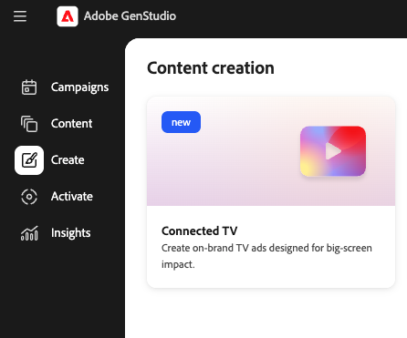

# Criar uma experiência de TV conectada

Use o [[!DNL Create]](/help/user-guide/create/overview.md) no [!DNL GenStudio for Performance Marketing] para criar anúncios de TV (CTV) conectados em um único local, desde diretrizes breves e compartilhadas até geração, refinamento baseado em cena, aprovação e exportação pronta para editor. O fluxo de trabalho abaixo é totalmente executado em [!DNL GenStudio for Performance Marketing]; não há aplicativo CTV separado ou editor incorporado.

## Pré-requisitos

Antes de criar um anúncio de CTV, confirme o seguinte:

* Acesso a [!DNL GenStudio for Performance Marketing].
* **[!DNL Brands]**, **[!DNL Products]** e **[!DNL Personas]** configurados como objetos compartilhados em [!DNL GenStudio for Performance Marketing]. Consulte [Visão geral das diretrizes](/help/user-guide/guidelines/overview.md) para entender como esses objetos informam a geração.
* Os ativos de campanha (clipes de vídeo, imagens, logotipos, música) são recomendados, mas não são obrigatórios. A IA gerativa pode preencher lacunas quando os ativos estão ausentes ou incompletos.

## Criar um novo anúncio de CTV

Tudo neste fluxo de trabalho acontece dentro de [!DNL GenStudio for Performance Marketing].

{width="50%"}
**Para navegar até a criação da CTV**:

1. Entrar em [!DNL GenStudio for Performance Marketing].
1. Na página inicial ou na superfície de criação, vá para **[!UICONTROL Criar]**.
1. Selecione **CTV** usando o cartão de criação do CTV.
1. Clique em **[!UICONTROL Criar Anúncio CTV]**.

Uma única experiência de criação de CTV simplificada é aberta. Você não precisa escolher um tipo de anúncio primeiro.

## Configurar o resumo

O resumo e as entradas determinam como o anúncio é gerado. Esta é a sua oportunidade de fornecer contexto e restrições para o processo de geração de anúncios.

{width=80%&quot; align=&quot;center&quot;}

**Para configurar o resumo**:

1. Selecione **[!DNL Brands]**, **[!DNL Products]** e **[!DNL Personas]** dos objetos compartilhados existentes.
1. Adicione o **resumo criativo** inserindo-o diretamente ou carregando-o. Inclua o objetivo da campanha, a mensagem principal e todas as restrições.
1. Defina a **duração do anúncio** para 15 segundos ou 30 segundos.
1. Opcionalmente, adicione **ativos**. Carregue clipes de vídeo, imagens, logotipos, música, narração ou cartões de introdução/conclusão (arraste e solte ou selecione arquivos) ou escolha ativos do seu repositório [!DNL Content].
1. Clique no botão **[!UICONTROL Gerar]**.

Se os ativos estiverem ausentes ou incompletos, o [!DNL GenStudio for Performance Marketing] poderá gerar cenas, músicas ou narração ausentes usando IA. O Assets que você fornece sempre tem prioridade sobre o material gerado.

[!DNL GenStudio for Performance Marketing] automaticamente:

* Interpreta o resumo junto com o contexto de **[!DNL Brands]**, **[!DNL Products]** e **[!DNL Personas]**.
* Monta uma estrutura de anúncio de CTV completa.
* Cria cenas, sobreposições de texto, música e narração, conforme necessário.
* Aplica duração e formatação compatíveis com CTV.

O resultado é um anúncio de CTV totalmente formado e visualizável, não uma linha do tempo de rascunho simples.

## Editar e refinar o anúncio

Use o editor baseado em cena para refinar o anúncio sem regenerar tudo.

Clique em uma cena na faixa de cena para abri-la para edição. As edições que podem ser realizadas incluem:

* Substituir ou regenerar uma única cena com IA.
* Edite o prompt do cenário para criar variantes.
* Reordenar ou aparar cenas.
* Editar sobreposições de texto.
* Troque, mudo ou substitua música e narração.
* Ajustar transições entre cenas.

A edição tem escopo para que você possa regenerar uma cena de cada vez, agilizando a iteração e a atualização criativa.

>[!NOTE]
>
>O editor não oferece suporte à alteração de objetos *dentro* de um clipe de vídeo (por exemplo, remoção de itens, alteração de cores do produto ou alteração da aparência das pessoas).

## Revisar e aprovar

Envie o anúncio para análise de marca usando seus fluxos de trabalho de aprovação integrados. Os revisores de marca e de partes interessadas verificam as mensagens, os visuais e a conformidade com a marca. Os aprovadores validam o anúncio; não é esperado que façam edição de vídeo no lugar do profissional de marketing.

## Exportar

Após a aprovação, é possível:

* Exporte o anúncio de CTV finalizado em um formato compatível e pronto para o editor.
* Salve o anúncio novamente em [!DNL Content].
* Use-a em workflows downstream de compras e tráfico de CTV.

O Creative deve estar pronto para ativação sem recodificação ou retrabalho.
