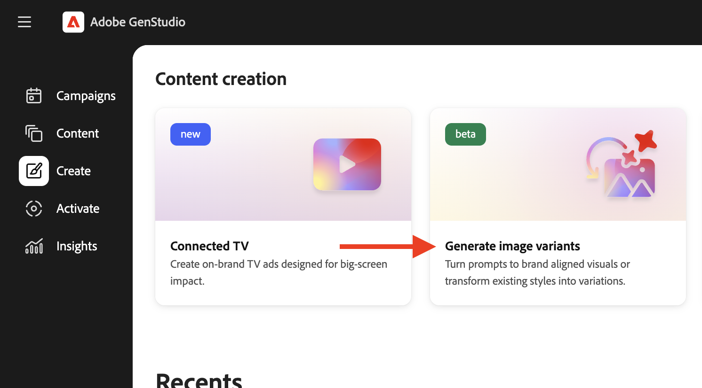

# Gerar variantes de imagem

Com o GenStudio for Performance Marketing [[!DNL Create]](/help/user-guide/create/overview.md) (ícone de pincel), você pode gerar _[!DNL Image variants]_&#x200B;ativos gerados que se inspiram em uma imagem escolhida, capturando seu impacto visual e estética geral.<!-- [two types of images](#image-types) using GenStudio for Performance Marketing [[!DNL Create]](/help/user-guide/create/overview.md) (paintbrush icon)—_[!DNL Image variants]_ and _[!DNL Similar images]_. -->

Para criar uma imagem atraente e eficiente, é recomendável [adicionar diretrizes ao GenStudio for Performance Marketing](/help/user-guide/guidelines/add-guidelines.md) e analisar as [noções básicas sobre como escrever prompts](/help/user-guide/effective-prompts.md).

## Tipos de imagem

_[!DNL Image variants]_&#x200B;são ativos gerados que se inspiram em uma imagem escolhida, capturando seu impacto visual e estética geral. Essas imagens são criadas usando imagens já disponíveis no [!DNL Content] e um prompt cuidadosamente criado que orienta o design. Eles seguem estritamente as diretrizes e os parâmetros de marca escolhidos durante o processo de geração.

_[!DNL Image variants]_<!-- and _[!DNL Similar images]_ --> incorpore diretrizes, parâmetros e um [prompt cuidadosamente preparado](/help/user-guide/effective-prompts.md) para fornecer ativos de imagem atraentes.

<!-- * _[!DNL Similar images]_—Image assets created with strong similarity to an existing selected image available in [!DNL Content]. When generating similar images, GenStudio for Performance Marketing redesigns the selected image, giving slight variations on the content to provide variety and nuance. -->

## Gerar variantes de imagem

Você pode gerar [!DNL Image variants] usando diretrizes, parâmetros e uma imagem de referência selecionada. Esses elementos, juntamente com o seu prompt, guiam a geração de [!DNL Image variants] consistente.

### Escolha uma imagem de referência

Para criar _[!DNL Image variants]_, selecione uma imagem existente salva em [!DNL Content]. Consulte [Práticas recomendadas para modelos](/help/user-guide/templates/best-practices-for-templates.md#follow-channel-specific-template-guidelines) para obter informações sobre dimensões de imagem compatíveis.

**Para escolher uma imagem de referência**:

1. Em _[!DNL Create]_, clique em **[!UICONTROL Gerar variantes de imagem]**.
   {width="400" zoomable="yes"}
1. Para escolher uma imagem de referência, use o botão _[!UICONTROL Selecionar do Conteúdo]_ para localizar uma imagem específica.
   {width="200" zoomable="yes"}

   Para usar ativos de um repositório [!DNL AEM Assets Content Hub] conectado, escolha um repositório no menu suspenso _Local_. Filtre e selecione uma imagem.

   {width="400" zoomable="yes"}

1. Na exibição _Selecionar imagem_, clique em uma imagem para marcar a caixa de seleção.

   A imagem selecionada pode ter até 10 mb de tamanho. Somente uma imagem pode ser selecionada de cada vez.

1. Clique em **[!UICONTROL Usar]**.

   A Tela, que serve como hub central para a criação de conteúdo, é exibida.

### Adicionar parâmetros

Incorporar [diretrizes](/help/user-guide/guidelines/overview.md) e parâmetros melhora o processo de geração de conteúdo e é uma etapa preparatória crucial para a produção de [!DNL Image variants].

**Para adicionar diretrizes e parâmetros**:

1. Na guia _Básico_, selecione um [!DNL Brand] para informar sobre a criação de conteúdo.

   Se não houver marcas disponíveis nesse menu, [adicione diretrizes à sua GenStudio for Performance Marketing](/help/user-guide/guidelines/add-guidelines.md).
1. Selecione um modelo a ser usado para geração de imagem de _[!UICONTROL Modelo]_.
1. Selecione a taxa de proporção desejada em _[!UICONTROL Taxa de proporção]_.

### Digite um prompt

Depois de selecionar os parâmetros, crie um prompt usando a linguagem natural para começar a gerar variantes de imagem.

Consulte [Gravar prompts efetivos](/help/user-guide/effective-prompts.md).

**Para inserir um prompt**:

1. Digite um prompt na caixa de prompt.
1. Clique em **[!UICONTROL Gerar]**.

Por padrão, quatro variações — alimentadas pelo prompt, pelos parâmetros e pelo conteúdo adicionado — são geradas e mostradas na Tela.

### Editar no Adobe Express

Depois de gerar variantes de imagem, você pode editá-las diretamente no Adobe GenStudio for Performance Marketing usando o Adobe Express.

**Para editar uma imagem individual usando o Adobe Express**:

1. Passe o mouse sobre uma variante de imagem gerada e clique em _[!UICONTROL Editar no Adobe Express]_.

   Uma janela _Powered by Adobe Express_ é exibida.

1. Execute a edição de imagens, como [recortando uma imagem](https://helpx.adobe.com/br/express/create-and-edit-images/edit-images/crop-images.html), [removendo um objeto](https://helpx.adobe.com/br/express/create-and-edit-images/create-and-modify-with-generative-ai/remove-objects-generative-fill.html) e aplicando efeitos.

   Consulte a [documentação do Adobe Express](https://helpx.adobe.com/br/express/user-guide.html) para saber como revisar imagens no GenStudio for Performance Marketing com o Adobe Express.

1. Clique em _[!UICONTROL Aplicar alterações]_ para salvar suas edições.
1. Continue editando variantes de imagem individuais conforme desejado e aplicando as alterações para salvar seu progresso.

### Verificar o alinhamento da verificação de conteúdo

Para otimizar as variantes geradas e garantir a estrita adesão à identidade da marca, às diretrizes da plataforma e aos padrões de acessibilidade, aproveite o potencial do painel [_Verificação de conteúdo_](/help/user-guide/guidelines/brand-validation.md#content-check-panel). Esse painel exibe detalhes abrangentes da verificação de conteúdo e ilumina áreas de aprimoramento.

**Para executar verificações de conteúdo**:

1. Clique no ícone do painel _Verificação de conteúdo_, na barra de ações à direita, para abrir o painel [_Verificação de conteúdo_](/help/user-guide/guidelines/brand-validation.md#content-check-panel). Veja um resumo das *Verificações de Necessidades de revisão* e *Aprovadas* para ver quais seções e diretrizes precisam ser aprimoradas.

   {width="500" zoomable="yes"}

1. Revise as variantes de imagem para garantir que suas variantes estejam alinhadas às verificações de conteúdo executadas.

Consulte [Validação da marca](/help/user-guide/guidelines/brand-validation.md).

<!-- 
## Generate Similar images

You can quickly generate images similar to a selected image within [!DNL Content] from the [!DNL Create] home.

**To create _[!DNL Similar images]_**:

1. In _[!DNL Create]_, click **[!UICONTROL Similar images]**.
1. Use the search option, adjacent to _Filter_, to find a specific image.

   To use assets from a connected [!DNL AEM Assets Content Hub] repository, choose a repository from the _Location_ drop-down menu. Filter and select one image.

1. In the _Select image_ view, click on an image.
1. Click **[!UICONTROL Use]**.

   The Canvas, which serves as the central hub for content creation, is displayed. Four image variations similar to the original selected image appear.

   {width="400" zoomable="yes"} 
-->

## Publicar e exportar imagens

Os rascunhos de imagens gerados são mostrados na seção _Recentes_ da página inicial [!DNL Create].

Para disponibilizar as imagens geradas para uso atual e futuro, publique-as no [!UICONTROL Conteúdo] e exporte-as para uso em suas campanhas de marketing.

1. **Para publicar suas novas imagens**, clique em **[!UICONTROL Publicar]** na barra de ferramentas superior.
   1. _[!UICONTROL Adicione detalhes]_, como _[!UICONTROL Campanhas]_ ou _[!UICONTROL Canais]_, se desejar.
   1. Clique em **[!UICONTROL Publicar]**.

1. **Para exportar suas novas imagens**, clique em **[!UICONTROL Exportar]** na barra de ferramentas superior.
   1. Selecione o formato (JPG ou PNG) e clique em **[!UICONTROL Exportar]**.

Consulte [[!DNL Content]](/help/user-guide/content/overview.md#search-and-find-approved-content).
