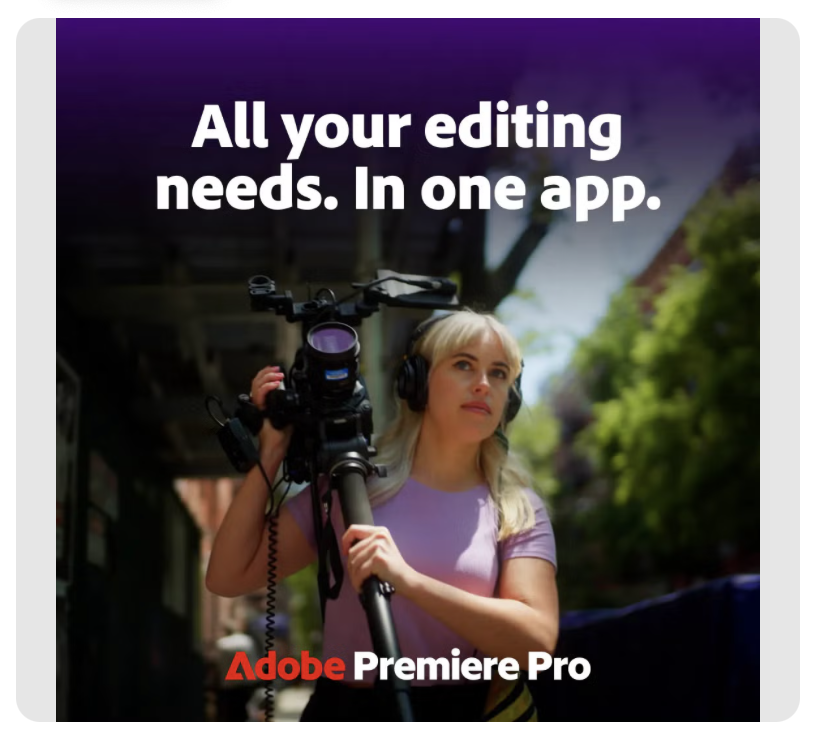

# Categorias de atributo

Uma categoria de atributo é um grupo de classificação que organiza atributos relacionados que compartilham uma característica comum. Essas categorias ajudam a simplificar a descoberta, a identificação e a compreensão de atributos específicos, fornecendo maior contexto e facilitando sua aplicação e uso.

O GenStudio for Performance Marketing usa os recursos de IA e aprendizado de máquina do Adobe para estudar imagens, vídeos e texto e aplicar os [!UICONTROL atributos de ativos] com base na probabilidade de correção. A lista de atributos de um ativo não é exaustiva. O Assets que contém um conjunto avançado de recursos pode ser limitado aos três recursos mais dominantes identificados pela IA.

## Recursos da imagem

Os recursos de imagem representam elementos ou padrões distintos e informativos em uma imagem que são usados para análise com [!DNL Insights]. A tabela a seguir lista as categorias de recursos de imagem reconhecidas pela IA do GenStudio for Performance Marketing.

<!-- For the writer: turn off word wrap to work with these tables. Option + Z -->

| Categoria | Descrição | Exemplo |
| ----------------------- | ----------------------------------------------------------------------------------------------------- | ------------------------------------------------------------------------------------------------------------------------------------------------------------------------------ |
| Ângulo da câmera | A localização e o ângulo da câmera em relação ao assunto. |                                                                                                                                                                                |
| Distância do assunto | A distância entre a câmera e o assunto de uma imagem. | `close up`, `mid shot`, `long shot` |
| Configuração da câmera | A configuração dos controles da câmera para produzir a imagem. |                                                                                                                                                                                |
| Cor e tom | Avalia as cores usadas nos elementos da imagem. Identifica de uma a três cores de um conjunto de 40 cores predeterminadas nas seguintes camadas de imagem: **[!UICONTROL Cores do primeiro plano ]**—elementos na camada da frente da imagem **[!UICONTROL Cores do plano de fundo]**—elementos na camada de fundo de uma imagem | Valores de cor: `Red`, `Dark_Red`, `Green`, `Bright_Green`, `Dark_Green`, `Light_Green`, `Mud_Green`, `Blue`, `Dark_Blue`, `Light_Blue`, `Royal_Blue`, `Black`, `White`, `Off_White`, `Gray`, `Dark_Gray`, `Silver`, `Cream`, `Magenta`, `Cyan`, `Yellow`, `Mustard`, `Khaki`, `Brown`, `Dark_Brown`, `Violet`, `Pink`, `Dark_Pink`, `Maroon`, `Tan`, `Purple`, `Lavender`, `Turquoise`, `Plum`, `Gold`, `Emerald`, `Orange`, `Beige`, `Lilac`, `Olive` |
| Temperatura de cor | Descreve o calor geral ou a frieza das cores na imagem. | Valores de tom ou temperatura: `warm`, `cool`, `neutral` {width="200" zoomable="yes"} |
| Estilo da imagem | O tratamento visual de uma imagem. |                                                                                                                                                                                |
| Condição de iluminação | O tipo de luz em uma imagem. |                                                                                                                                                                                |
| Objetos | Identifica um ou mais itens, entidades e elementos que compõem a imagem. | {width="200" zoomable="yes"} |
| Orientação | A posição da imagem em relação à taxa de proporção. | `landscape`, `portrait`, `square` |
| Pessoas | Quando pelo menos uma pessoa estiver presente, um ou mais atributos podem descrever a pessoa ou as pessoas na imagem. | {width="200" zoomable="yes"} |
| Gêneros de fotografia | Detecta o assunto e a técnica usada para capturar uma imagem, como `abstract` ou `landscape` (não a mesma que a orientação paisagem). |           |
| Cenas | Detecta a configuração ou o ambiente representado em uma imagem. |                                             |
| Tags | Detecta objetos, elementos e outras características da imagem que não se enquadram em uma classificação específica. |                                      |

<!-- Not yet approved by legal
| Attention distribution  | The level of viewer attention spread across an image.                                                 | `high`, `medium`, `low`                                                                                                                                                                                                    |
| Content density         | The amount of information or detail in an image.                                                      | `high`, `medium`, `low`                                                                                                                                                                                                    |
-->

## Recursos de vídeo

Os recursos de imagem representam elementos, sons ou padrões distintos e informativos em um vídeo para análise com o [!DNL Insights]. A tabela a seguir lista as categorias de recursos de vídeo reconhecidas pela IA do GenStudio for Performance Marketing.

| Categoria | Descrição | Exemplo |
| ------------------- | ------------------------------------------------------------------------------------------------------------ | --------------------------------------------------------------------------------------- |
| Gênero de áudio | Quando houver música, o vídeo poderá receber uma classificação de estilo de música, como `electronic` ou `classical`. |          |
| Categoria de Gênero de Áudio | Quando houver música, o vídeo poderá receber uma ampla classificação de gênero musical, como `acoustic` ou `traditional`. |          |
| Modo de áudio | Descreve a atmosfera ou o tom geral do áudio, como `relaxing` ou `energetic`. |          |
| Tipos de áudio | Quando há áudio presente, o vídeo pode receber uma marca para um ou mais tipos de áudio, como `music` ou `speech`. |          |
| Objetos | Identifica um ou mais itens, entidades e elementos que aparecem no vídeo. | {width="200" zoomable="yes"} |
| Orientação | A posição do vídeo em relação à proporção do quadro. | `landscape`, `portrait`, `square` |
| Pessoas | Quando houver pelo menos uma pessoa, um ou mais atributos podem descrever a pessoa ou as pessoas no vídeo. |        |
| Cenas | A configuração ou o ambiente representado no vídeo. |        |
| Estilos | Detecta tratamentos visuais aplicados a elementos no vídeo, como `matte` ou `neon`. |        |
| Tags | Detecta objetos, elementos e outras características de vídeo que não se enquadram em uma classificação específica. |        |

## Recursos de texto

Os recursos de texto incluem contagens para determinados elementos de texto, como palavras, sentenças, emojis e classificações para semântica, emoção e tom usados para análise com [!DNL Insights]. O texto também pode receber uma pontuação de legibilidade. Em breve.

<!-- Not yet approved by legal

The following table lists the image feature categories recognized by the GenStudio for Performance Marketing AI.

| Category             | Description | Example |
|----------------------|-------------|--------|
| Emojis Count         |             |        |
| HashTags Count       |             |        |
| Keywords             |             |        |
| Marketing Emotions   |             |        |
| Narratives           | Text that represents an overarching situation, theme, or a story. Narratives can communicate values, purpose, or identity that resonates with consumers on many levels.   |        |
| Persuasion Strategies|             |        |
| Readability          |             |        |
| Tone of voice        | | |
-->
