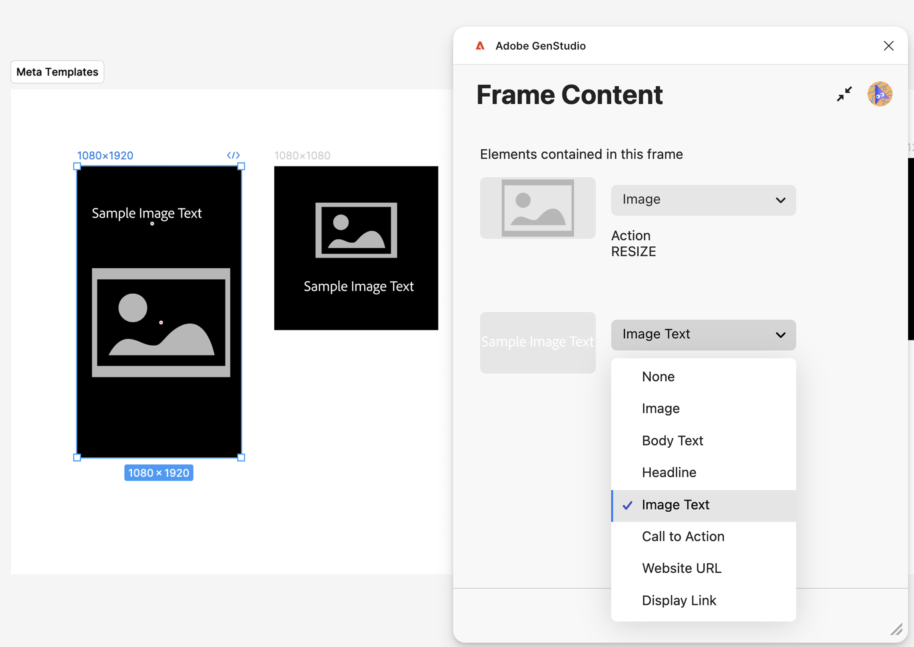
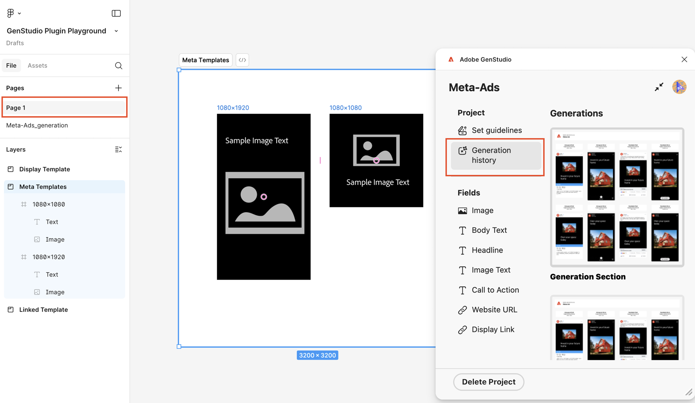

# Plug-in Figma para GenStudio for Performance Marketing

O plug-in Figma do GenStudio for Performance Marketing adiciona um novo painel ao aplicativo Figma que permite gerar conteúdo na marca.

Esta página descreve como configurar e usar o plug-in.

Os recursos deste plug-in incluem:

* Mapeie elementos de texto Figma para campos GenStudio for Performance Marketing, como `headline`, `body`, `on_image_text` e muito mais.
* Gerar novo anúncio de exibição, LinkedIn ou Meta sob marca [!DNL Experiences] com base em marca, persona, produto e prompt de texto.
* Crie [!DNL Experiences] diretamente no documento Figma substituindo o texto em elementos Figma mapeados por valores gerados pelo GenStudio for Performance Marketing.
* reformular, encurtar, aumentar ou traduzir conteúdo existente com base em um prompt.
* Traduzir o [!DNL Experiences] gerado em vários idiomas.
* Exportação gerada [!DNL Experiences] para uma origem local como imagens niveladas.
* Exportação gerada [!DNL Experiences] para o GenStudio for Performance Marketing.
* Use as opções de plug-in que se adaptam aos elementos selecionados na tela do Figma.

>[!VIDEO](https://video.tv.adobe.com/v/3478814?captions=por_br&learn=on)

## Criar um modelo

O plug-in requer os dois primeiros níveis do seu documento do Figma para seguir esta convenção:

* **Seção** - Representa o projeto pai, que pode conter vários modelos.
* **Quadro** - Representa um modelo dentro de um projeto. O modelo pode ser preenchido com texto, imagens, componentes e outros elementos.

### Modelos do Meta

Estes tamanhos de modelo são compatíveis:

Para publicações no Instagram ou no Facebook:

* Largura: 1080 px (fixa)
* Altura: 1080 px ou 1350 px

Para histórias do Instagram ou do Facebook:

* Largura: 1080 px (fixa)
* Altura: 1920 px

O plug-in decide o cromo da experiência gerada com base na altura do template.

### Modelos de exibição

Não há requisito de tamanho fixo. Os modelos de exibição são compatíveis com qualquer tamanho.

### Modelos do LinkedIn

* Largura: 1200 px (fixa)
* Altura: 1200 px, 628 px, 2292 px, 1800 px ou 1500 px

### Mapeamento de funções do campo

O plug-in precisa entender os diferentes elementos do seu modelo, como título, corpo de texto ou imagem.

Para atribuir funções de elemento:

1. Selecione um elemento no modelo (texto, imagem etc.).
1. Use o menu suspenso para atribuir uma função.

O plug-in lembra desses mapeamentos para usar no conteúdo gerado. Uma função de campo\ pode ser mapeada para vários elementos de modelo.

{width="600"}

### Exceções de mapeamento de campo

{{$include /help/_includes/field-mapping-exceptions.md}}

## Gerar novo conteúdo

Use a IA do GenStudio for Performance Marketing para gerar ou fazer variações em elementos nos modelos do Figma.

1. Se você usa o GenStudio Plugin Playground ou modelos já preparados, selecione o nó da seção que contém seus modelos de anúncios. Você pode fazer isso no painel **Camadas** ou clicando diretamente na seção na tela.
   {width="500" zoomable="yes"}
1. Na janela de plug-in, insira um nome de projeto para as variações, escolha uma plataforma para o conteúdo e preencha as outras informações necessárias. Em seguida, clique no botão **[!UICONTROL Concluir Instalação]**.
   {width="300" zoomable="yes"}
1. Selecione os [!DNL Brand], [!DNL Persona] e [!DNL Product] a serem usados para a geração de conteúdo.
1. Selecione o número de variações a serem produzidas (até oito).
1. Use o botão em **[!UICONTROL Selecionar conteúdo]** para procurar e escolher imagens dos seus ativos. Os 40 ativos adicionados mais recentemente aparecem primeiro e você pode pesquisar outros ativos. As imagens selecionadas são redimensionadas automaticamente para se ajustarem aos seus modelos.
1. Digite um prompt de texto. Cada campo na lista **[!UICONTROL Campos]** tem a opção **[!UICONTROL Ação]** definida como **[!UICONTROL Gerar]** para novo conteúdo.
1. Mapeie todas as funções de campo. Consulte [Mapeamento de função de campo](#field-role-mapping).
1. Clique no botão **[!UICONTROL Gerar]**.

## Traduzir ou gerar variações de cópia de anúncio a partir de conteúdo existente

Use a IA do GenStudio for Performance Marketing para gerar variações de cópia de anúncios ou traduzir modelos do Figma.

1. Selecione o nó da seção que contém seus modelos de anúncios. Você pode fazer isso no painel **Camadas** ou clicando diretamente na seção na tela.
   {width="500" zoomable="yes"}
1. Na janela de plug-in, insira um nome de projeto para as variações e escolha uma plataforma para o conteúdo.
1. Em **[!UICONTROL Qual é a meta?]**, selecione **[!UICONTROL Gerar Variações]** ou **[!UICONTROL Traduzir]** e clique no botão **[!UICONTROL Concluir Instalação]**.
   {width="300" zoomable="yes"}
1. Selecione os [!DNL Brand], [!DNL Persona] e [!DNL Product] a serem usados para a geração de conteúdo.
1. Selecione o número de variações a serem produzidas.
1. Use o botão em **[!UICONTROL Selecionar conteúdo]** para procurar e escolher imagens dos seus ativos. Os 40 ativos adicionados mais recentemente aparecem primeiro e você pode pesquisar outros ativos. As imagens selecionadas são redimensionadas automaticamente para se ajustarem aos seus modelos.
1. Digite um prompt de texto. Cada campo na lista **[!UICONTROL Campos]** tem a opção **[!UICONTROL Ação]** definida como **[!UICONTROL Gerar]** para novo conteúdo.
1. Mapeie todas as funções de campo. Consulte [Mapeamento de função de campo](#field-role-mapping).
1. Selecione cada tipo de campo para gerar variações ou traduzir no painel no lado esquerdo do plug-in e cole o conteúdo inicial em cada caixa de **[!UICONTROL Conteúdo inicial]**.
   {width="60%" zoomable="yes"}
1. Clique no botão **[!UICONTROL Gerar]**.

## Traduzir conteúdo após geração

1. Selecione uma geração que deseja traduzir.
   {width="200" zoomable="yes"}
1. Escolha **[!UICONTROL Tradução]** e clique em **[!UICONTROL Traduzir]**.
1. Selecione o idioma ou idiomas de destino.
1. Clique em **[!UICONTROL Selecionar]**.

Os resultados da tradução incluem:

* Uma nova página é exibida com conteúdo traduzido.
* Cada tradução mostra o idioma ou localidade de destino.
* O conteúdo original permanece inalterado na página original.

{width="60%" zoomable="yes"}

## Outras ações em campos de conteúdo após a geração

Quando você está editando o conteúdo existente em um campo, opções úteis aparecem no painel de plug-in.

{width="300" zoomable="yes"}

As opções incluem:

* Altere o **[!UICONTROL Valor]** para alterar o texto diretamente. A alteração desse conteúdo se aplica automaticamente a todas as variações selecionadas.
* A IA pode executar várias opções de **[!UICONTROL Ação]**, incluindo:

| Ação | Descrição |
| --- | --- |
| **[!UICONTROL Gerar]** | Gerar uma nova variação do texto. |
| **[!UICONTROL Refrase]** | Gerar uma nova variação do texto. |
| **[!UICONTROL Encurtar]** | Gere uma variação mais curta do texto. |
| **[!UICONTROL Ampliar]** | Gere uma variação mais longa do texto. |

Depois de selecionar uma opção **[!UICONTROL Ação]**, gere novamente o conteúdo com o botão **[!UICONTROL Gerar novamente]**.

## Gerar uma imagem

Gere imagens para usar em seus modelos usando um prompt de texto.

1. Selecione **[!UICONTROL Gerar Imagem]**.
1. Selecione um modelo no menu suspenso. Você também pode escolher qualquer modelo personalizado que tenha criado.
1. Selecione o ícone de configurações para ajustar as configurações de geração.
1. Opcional: Selecione uma taxa de proporção.
1. Opcional: Ajuste o estilo da imagem seguindo um destes procedimentos:
   * Carregue uma imagem de referência do seu dispositivo ou AEM selecionando **[!UICONTROL Carregar imagem]**.
   * Escolha uma das imagens de estoque da Adobe selecionando **[!UICONTROL Procurar na Galeria]**.
   * Escolha um valor de intensidade usando o controle deslizante. A força ajusta a estrita aderência do Firefly ao estilo fornecido.
1. Selecione o botão **&lt;**.
1. Digite um prompt.
1. Selecione o ícone Gerar. As imagens são exibidas no painel do plug-in.
1. Traga imagens para a tela de desenho usando um destes métodos:
   * Arraste e solte qualquer imagem na tela de desenho.
   * Selecione um quadro na tela de desenho do Figma e selecione uma imagem na janela de plug-in para inserir no quadro.
   * Selecione o ícone de upload para fazer upload de uma imagem na tela.
   * Selecione os 3 pontos e **[!UICONTROL Baixe tudo para o Figma]**.
1. Opcional: Selecione os 3 pontos para executar outras ações:
   * Selecione **[!UICONTROL Gerar mais]** para executar o prompt novamente.
   * Selecione **[!UICONTROL Copiar prompt]** para copiar o prompt.
1. Opcional: Selecione o ícone de lápis para usar o preenchimento Gerativo e Gerar ações semelhantes em uma única imagem.

## Gerar imagens semelhantes

Gere um conjunto de imagens semelhantes.

1. Selecione o cartão **[!UICONTROL Gerar semelhante]**.
1. Selecione uma imagem como referência seguindo um destes procedimentos:
   * Selecione uma imagem na tela de desenho Figma.
   * Selecione **[!UICONTROL Carregar imagem]** para carregar do seu dispositivo.
   * Selecione **[!UICONTROL Procurar ativos do AEM]** para carregar do AEM.
1. Selecione o ícone Gerar. As variações aparecem no painel de plug-in.
1. Traga imagens para a tela de desenho usando um destes métodos:
   * Arraste e solte qualquer imagem na tela de desenho.
   * Selecione um quadro na tela de desenho do Figma e selecione uma imagem na janela de plug-in para inserir no quadro.
   * Selecione o ícone de upload para fazer upload de uma imagem na tela.
   * Selecione os 3 pontos e **[!UICONTROL Baixe tudo para o Figma]**.
1. Opcional: Selecione os 3 pontos para executar outras ações:
   * Selecione **[!UICONTROL Gerar mais]** para executar o prompt novamente.
1. Opcional: Selecione o ícone de lápis para usar o preenchimento Gerativo e Gerar ações semelhantes em uma única imagem.

## Remover fundo

Remover o plano de fundo de uma imagem.

1. Selecione o cartão **[!UICONTROL Remover Plano de Fundo]**.
1. Selecione uma imagem como referência seguindo um destes procedimentos:
   * Selecione uma imagem na tela de desenho Figma.
   * Selecione **[!UICONTROL Carregar imagem]** para carregar do seu dispositivo.
   * Selecione **[!UICONTROL Procurar ativos do AEM]** para carregar do AEM.
1. Selecione **[!UICONTROL Remover]**. Se a imagem tiver sido selecionada na tela de desenho, ela será substituída na tela de desenho Figma. Se a imagem tiver sido selecionada de um dispositivo ou AEM, você poderá arrastar e soltar a imagem na tela ou selecionar **[!UICONTROL Inserir Imagem]** para colocar a imagem na tela.

## Preenchimento Gerativo

Aplique preenchimentos generativos para uma área de uma imagem.

1. Selecione o cartão **[!UICONTROL Preenchimento Gerativo]**.
1. Selecione uma imagem como referência seguindo um destes procedimentos:
   * Selecione uma imagem na tela de desenho Figma.
   * Selecione **[!UICONTROL Carregar imagem]** para carregar do seu dispositivo.
   * Selecione **[!UICONTROL Procurar ativos do AEM]** para carregar do AEM.
1. Selecione a ferramenta Pincel e crie uma máscara.
1. Opcional: Selecione o cursor suspenso e ajuste o tamanho do pincel.
1. Selecione o botão de redefinição para remover a máscara.
1. Opcionalmente, selecione o ícone remover plano de fundo para remover o plano de fundo.
1. Digite um prompt para orientar a geração da máscara selecionada e selecione o botão **[!UICONTROL Gerar]**.
1. Traga imagens para a tela de desenho usando um destes métodos:
   * Arraste e solte qualquer imagem na tela de desenho.
   * Selecione um quadro na tela de desenho do Figma e selecione uma imagem na janela de plug-in para inserir no quadro.
   * Selecione o ícone de upload para fazer upload de uma imagem na tela.
   * Selecione os 3 pontos e **[!UICONTROL Baixe tudo para o Figma]**.
1. Opcional: Selecione os 3 pontos para executar outras ações:
   * Selecione **[!UICONTROL Copiar prompt]** para copiar o prompt.
1. Opcional: Selecione o ícone de lápis para usar o preenchimento Gerativo e Gerar ações semelhantes em uma única imagem.

## Avisar para editar

Edite o conteúdo de uma imagem com um prompt de texto.

1. Selecione o cartão **[!UICONTROL Avisar para editar]**.
1. Selecione uma imagem como referência seguindo um destes procedimentos:
   * Selecione uma imagem na tela de desenho Figma.
   * Selecione **[!UICONTROL Carregar imagem]** para carregar do seu dispositivo.
   * Selecione **[!UICONTROL Procurar ativos do AEM]** para carregar do AEM.
1. Selecione o ícone de configurações para ajustar as configurações de geração.
1. Opcional: Selecione uma taxa de proporção e o botão **&lt;**.
1. Digite um prompt para orientar a geração e selecione o botão **[!UICONTROL Gerar]**.
1. Traga imagens para a tela de desenho usando um destes métodos:
   * Arraste e solte qualquer imagem na tela de desenho.
   * Selecione um quadro na tela de desenho do Figma e selecione uma imagem na janela de plug-in para inserir no quadro.
   * Selecione o ícone de upload para fazer upload de uma imagem na tela.
   * Selecione os 3 pontos e **[!UICONTROL Baixe tudo para o Figma]**.
1. Opcional: Selecione os 3 pontos para executar outras ações:
   * Selecione **[!UICONTROL Gerar mais]** para executar o prompt novamente.
   * Selecione **[!UICONTROL Copiar prompt]** para copiar o prompt.
1. Opcional: Selecione o ícone de lápis para usar o preenchimento Gerativo e Gerar ações semelhantes em uma única imagem.

## Expansão gerativa

Expanda as dimensões das suas imagens e adicione conteúdo generativo com a expansão Gerativa. A expansão gerativa permite transformar imagens ajustadas na proporção mais adequada para modelos de Banners, Meta ads, anúncios do LinkedIn ou anúncios de exibição.

1. Selecione o cartão **[!UICONTROL Expansão Gerativa]**.
1. Selecione uma imagem na tela de desenho.
1. Redimensione o quadro Gen Expand Temporary para as novas dimensões desejadas.
1. Opcional: mova a imagem para qualquer lugar dentro do quadro.
1. Digite um prompt para orientar a geração e selecione o botão **[!UICONTROL Gerar]**.
1. Selecione qualquer imagem na tela para substituir a imagem original pelo resultado gerado.

## Exportar experiências

As variações podem ser exportadas do Figma as GenStudio for Performance Marketing [!DNL Experiences].

1. Selecione o conteúdo a ser exportado na tela do Figma seguindo um destes procedimentos:
   * Selecione a seção de geração na tela e clique em **[!UICONTROL Marcar tudo para exportação]** no painel de plug-in.
     {width="200" zoomable="yes"}
   * Selecione uma geração individual na tela e clique em **[!UICONTROL Marcar para exportação]** no painel de plug-in.
     {width="200" zoomable="yes"}
1. Selecione o item Exportar no menu da barra lateral.
   {width="60%" zoomable="yes"}
1. Selecione um destino.
1. Clique em **[!UICONTROL Exportar]** para exportar o conteúdo.

Um arquivo ZIP foi criado no painel de plug-in ou um link para **[!UICONTROL Abrir no GenStudio]** é exibido. Use o link do ZIP para escolher onde salvar o arquivo ou selecione **[!UICONTROL Abrir no GenStudio]**.

## Histórico de geração

O plug-in mantém um histórico de alterações para cada campo. Na página do modelo, escolha **[!UICONTROL Histórico de geração]** na barra lateral do plug-in.

{width="80%" zoomable="yes"}

## Solução de problemas

Considere essas práticas recomendadas e dicas se o texto ou as imagens não estiverem sendo substituídos em variações geradas.

### Campos mapeados

Se o texto ou as imagens não estiverem sendo substituídos, verifique se os campos foram mapeados para funções de campo do GenStudio na interface do usuário do plug-in. Consulte [Mapeamento de função de campo](#field-role-mapping).

### Confirmar se as fontes estão disponíveis

A fonte de um campo de texto deve estar disponível no computador para que a substituição ocorra durante a geração. Confirme se todas as fontes usadas no arquivo estão disponíveis no computador, especialmente se o arquivo foi criado no computador de outra pessoa.

### Considere o suporte à função no campo

Alguns canais só oferecem suporte à substituição em campos específicos. Esteja ciente das exceções para [mapeamento de função de campo](#field-role-mapping).
