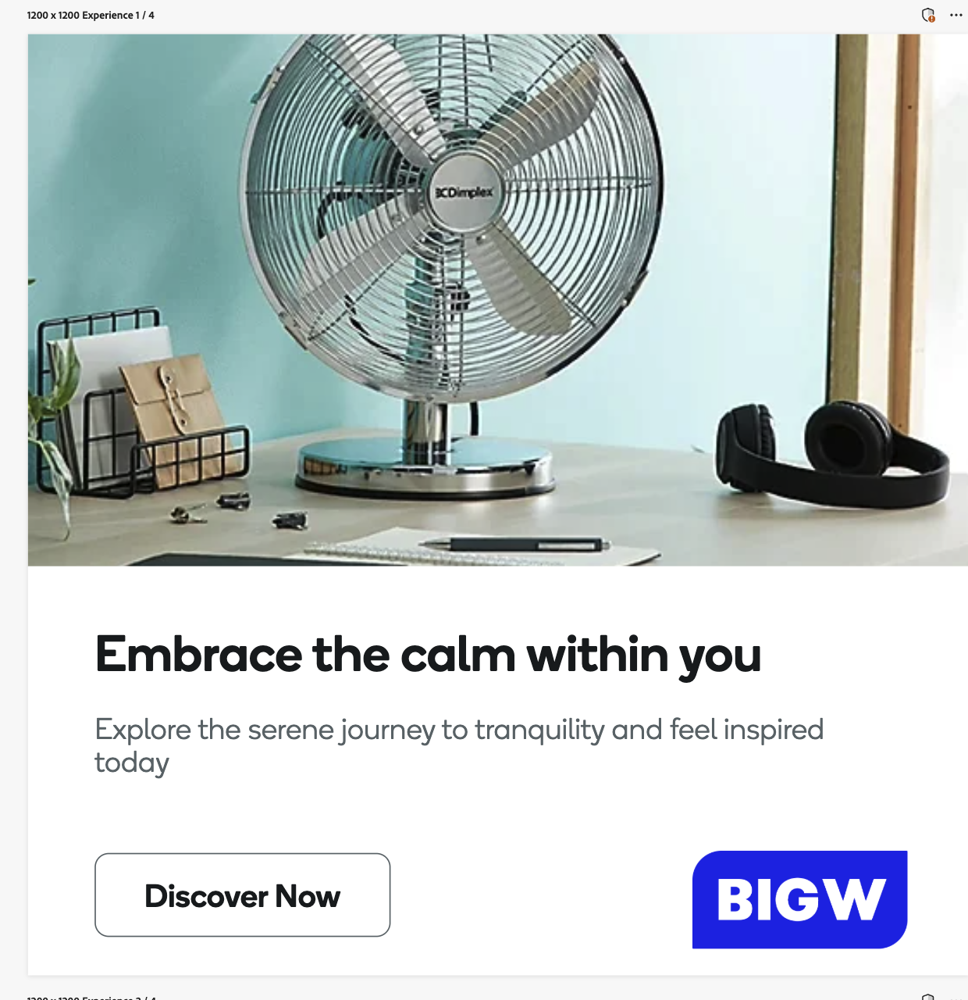

# Exibir diretrizes do modelo de anúncio

Os modelos de exibição são layouts pré-projetados usados para criar banners e anúncios de exibição visualmente envolventes. Elas fornecem uma estrutura flexível para incorporar imagens, texto e call to action, garantindo consistência e eficiência ao produzir várias variações de anúncios. Ao preparar seu modelo para uso no GenStudio for Performance Marketing, verifique se todos os ativos estão otimizados para exibição na Web e atendem aos formatos e tamanhos de arquivo necessários.

Siga estas práticas recomendadas de design ao personalizar modelos de Banner e Anúncio de exibição para funcionar com o GenStudio for Performance Marketing:

- Usar fontes do Adobe ou Google
- Prepare ativos que sejam bem exibidos em dimensões finas
- É necessário exatamente um campo de imagem
- **não** usar imagens de fundo inseridas ou codificadas
- Use imagens de plano de fundo (campo `image`) carregadas no repositório de conteúdo do GenStudio for Performance Marketing. Siga as diretrizes em [Carregando imagens para anúncios de exibição](#uploading-images-for-display-ads) para obter melhores resultados
- **não** usar o JavaScript
- Somente uma seção pode ser usada, gerando um único conjunto de elementos de modelo

## Nomes de campo reconhecidos

Ao personalizar seu banner ou modelo de anúncio de exibição, use espaços reservados para conteúdo para os seguintes campos obrigatórios:

- `headline`
- `sub_headline`
- `body`
- `image` (obrigatório, selecionado no JPEG de conteúdo, PNG ou GIF)

O GenStudio for Performance Marketing gera automaticamente os campos a seguir. Não é necessário aplicar espaços reservados para conteúdo para:

- `cta`

Consulte [Espaços reservados para conteúdo](/help/user-guide/content/customize-template.md#content-placeholders) para entender mais sobre o uso de nomes de campo em modelos.

## Dimensões suportadas

A Largura x Altura (pixels) deve ser definida.

| Orientação | Dimensões (pixels) | Notas |
|--------------|-------------------------------------------------------------|------------------------------------------------------------------|
| Vertical | 300 x 600 160 x 600 | Comum a banners de meia página e arranha-céus. |
| Horizontal | 300 x 250 728 x 90 336 x 280 320 x 50 970 x 250 | Quadro de classificação padrão, retângulo médio e tamanhos de banner. |
| Personalizado | 50 x 50 a 2000 x 2000 | Use para disposições não padrão ou exclusivas; verifique os limites da plataforma. |

## Carregamento de imagens para anúncios de exibição

As imagens usadas em anúncios de exibição devem vir do repositório de conteúdo e precisam ser carregadas corretamente para garantir que a imagem seja exibida com precisão no modelo.

Quando um modelo de exibição apresenta uma imagem de borda a borda (sangria completa), a imagem selecionada é redimensionada automaticamente para se ajustar às dimensões completas do modelo. No entanto, se a imagem não corresponder à taxa de proporção do modelo, ela será cortada para se ajustar às dimensões do modelo e poderá não ser exibida conforme esperado.

Não há nenhuma funcionalidade de &quot;ajuste automático&quot; para imagens em modelos de anúncios de exibição.

Para resolver o corte da imagem, os usuários devem definir a proporção da imagem no modelo quando ele for carregado no repositório de conteúdo. Ao fazer upload de um modelo de anúncio de exibição aprovado:

1. [Continue com o processo de carregamento do modelo](/help/user-guide/content/use-templates.md#add-a-template) até chegar à página **[!UICONTROL Adicionar detalhes]**.

1. Defina a proporção da imagem a ser usada no modelo em **[!UICONTROL Largura do anúncio (px)]** e **[!UICONTROL Altura do anúncio (px)]**. Isso definirá a janela de imagem para a seção do modelo que exibe a imagem.

1. Na seção **[!UICONTROL Mais detalhes]**, selecione a lista suspensa **[!UICONTROL Tamanho da imagem]** e escolha _Cortar para um tamanho fixo_.
   {width="80%"}

Para determinar o tamanho e a proporção de uma imagem no navegador:

1. Inspecione a imagem.
   - Windows/Linux:
      - Pressione F12.
   - macOS:
      - Pressione Command + Option + I.

1. Passe o mouse sobre a imagem.

1. Observe a taxa de proporção. Use essa opção para definir a proporção da imagem no modelo.

Quando esses detalhes não são aplicados durante o upload, presume-se que a imagem seja a proporção inteira do modelo e as imagens que não corresponderem exatamente a essa proporção aparecerão cortadas.

{width="60%"}

**❌Imagem cortada em um modelo de anúncio de exibição**

{width="60%"}

**✅Imagem totalmente exibida**
