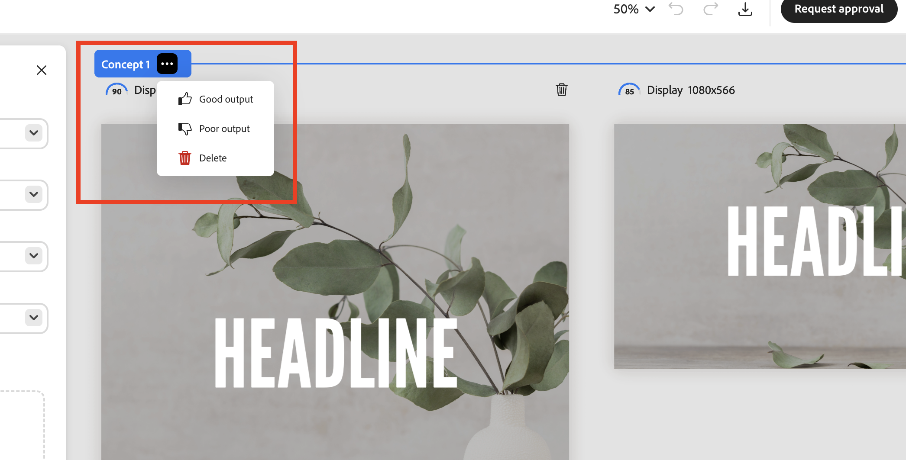
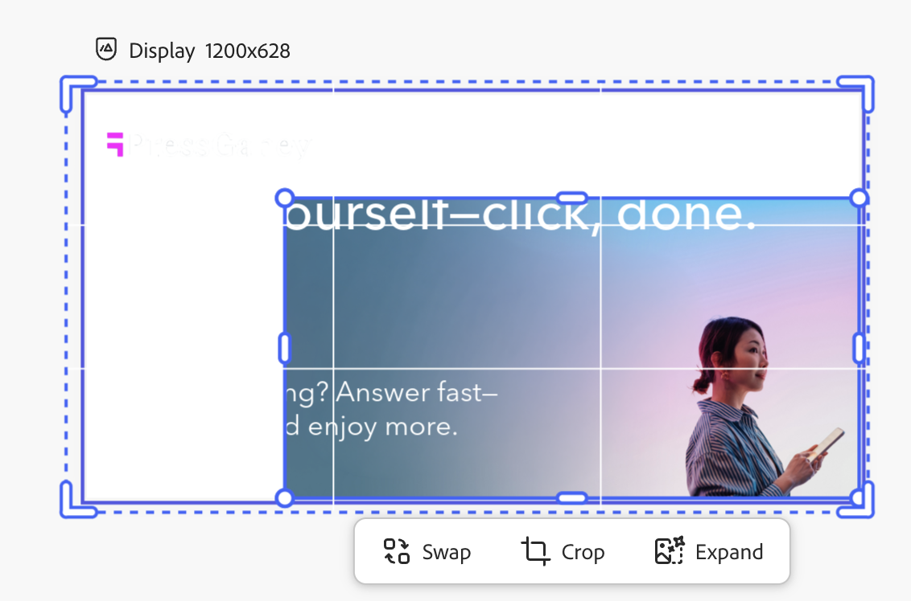
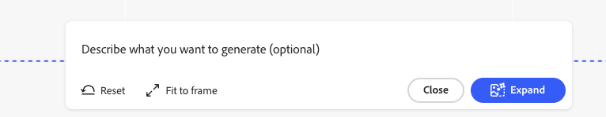

# Usando modelos [!DNL Adobe Express]

[!DNL GenStudio for Performance Marketing] pode usar modelos que foram criados e criados em [!DNL Adobe Express]. Traga ativos de marca de [!DNL Adobe Express] e use essas ferramentas poderosas para integrá-los em campanhas de marketing atraentes e [!DNL Experiences].

Este guia explica os requisitos e os recursos com modelos do [!DNL Adobe Express]. Para obter mais dicas e práticas recomendadas, consulte [Práticas recomendadas para usar modelos](/help/user-guide/templates/best-practices-for-templates.md#express-to-genstudio-template-best-practices).

## Sobre modelos em [!DNL Adobe Express]

Em [!DNL Adobe Express], [novos documentos podem ser criados usando modelos iniciais existentes](https://helpx.adobe.com/br/express/web/documents-and-presentations/text-flow-template.html?x-product=Helpx%2F1.0.0&x-product-location=Search%3AForums%3Alink%2F3.7.5) fornecidos no aplicativo ou com [modelos personalizados que podem incluir restrições úteis de marca](https://helpx.adobe.com/br/express/web/brands-libraries-projects/create-manage-brands/edit-shared-template.html), como:

- [Elementos bloqueados](https://helpx.adobe.com/br/express/web/invite-collaborate/object-locking.html) que não podem ser alterados
- Bloquear restrições que controlam como os usuários podem desbloquear elementos quando necessário

As configurações de bloqueio definidas no modelo em [!DNL Adobe Express] também serão aplicadas em [!DNL GenStudio for Performance Marketing]. Use as [instruções [!DNL Adobe Express] para criar um modelo personalizado com restrições de marca](https://helpx.adobe.com/br/express/web/brands-libraries-projects/create-manage-brands/template-control.html).

Para usar fontes personalizadas em um modelo expresso, os administradores devem primeiro aceitar a oferta de qualificação Fontes personalizadas no Admin Console, que está incluído como parte do direito de licença do Express.

## Localizar modelos do Express

Os usuários verão novas guias em Criar para selecionar modelos Expressos. Os modelos expressos podem ser acessados no GenStudio for Performance Marketing quando esses modelos são:

- Criado pelo usuário
- Compartilhado com o usuário
- Compartilhado na organização do usuário, usando a mesma organização IMS em ambos os aplicativos

Localize todos os modelos do Express disponíveis em Criar fluxo de trabalho, após selecionar um tipo de modelo. Os modelos expressos estão disponíveis apenas para os tipos:

- [!DNL Meta]
- [!DNL Display]
- [!DNL LinkedIn]
- [!DNL TikTok]

Na barra superior em **[!UICONTROL Selecionar modelo]**, localize **Modelos expressos**.

{width=70%}

Ao selecionar um modelo [!DNL Express] e clicar em **[!UICONTROL Usar]**, os parâmetros e o prompt de pré-rascunho aparecerão em um painel pop-up à esquerda. Clique no botão **[!UICONTROL Gerar]** para criar novo conteúdo com o modelo selecionado.

{width=90%}

>[!IMPORTANT]
>
>Durante a geração de conteúdo, as camadas de modelo Expresso serão marcadas automaticamente com funções de campo para [!DNL GenStudio for Performance Marketing]. Os elementos em um modelo também podem ser [marcados manualmente](#manual-tagging-of-templates).

## Sobre variantes e [!DNL Experiences] com [!DNL Adobe Express] modelos

[!DNL Express] modelos oferecem muitos dos mesmos recursos com os quais você estará familiarizado ao [gerenciar outras variantes](https://experienceleague.adobe.com/pt-br/docs/genstudio-for-performance-marketing/user-guide/create/manage-variants#manually-edit-text). No entanto, há algumas adições importantes para simplificar qualquer fluxo de trabalho para o conteúdo de [!DNL Express]. Esta seção descreve recursos exclusivos para a implementação [!DNL Adobe Express].

### Gerar automaticamente vários tamanhos

Quando [várias páginas foram criadas para um ativo em [!DNL Express]](https://helpx.adobe.com/br/express/web/arrange-layers-and-pages/add-pages.html), essas páginas são transferidas para qualquer modelo criado a partir desse ativo. Cada página expressa será gerada como tamanhos diferentes do conteúdo criativo no [!DNL GenStudio for Performance Marketing].

Quando existe conteúdo de vários tamanhos para um ativo em [!DNL Express], as variantes podem ser geradas para todos esses tamanhos em uma única geração.

### Reposicionar e redimensionar elementos

Os elementos em um modelo podem ser redimensionados ou movidos para ajuste simplesmente clicando e arrastando esses elementos no painel Tela de desenho.

Redimensionar clicando e arrastando um elemento de um ponto de vértice.

### Recursos de cabeçalho do painel de tela

Use os botões no cabeçalho do painel Tela de Pintura para:

1. Renomear o rascunho
1. Alterar o nível de zoom de exibição
1. Desfazer e refazer alterações

### Atribuir feedback do grupo de experiência

Atribua feedback a cada grupo de variantes geradas. Esses rótulos de feedback ajudam a IA a entender quais variantes devem ser consideradas nas gerações subsequentes.

Clique em &quot;...&quot; para abrir a lista suspensa para:

- Boa saída
- Saída ruim
- Excluir - Exclui o grupo de variantes.

### Excluir uma variante

Um único tamanho de variante gerado em um grupo de Experiências pode ser excluído usando o ícone de lixeira.

{width=300}

### Barra de espaço para panorâmica

Segure **[!UICONTROL Espaço]** para habilitar um recurso de clicar e arrastar para &quot;puxar&quot; o painel de exibição da Tela.

Também é possível mover o painel de exibição com uma rolagem de dois dedos.

### Editar texto manualmente

É possível editar os campos de texto em variantes geradas. Refine o texto para o público-alvo fazendo experiências com diferentes frases e verbos e aplicando a formatação. Por exemplo, é possível alinhar em negrito e à direita o texto de uma variante para acomodar o layout de uma imagem.

{width=60%}

A formatação de texto disponível inclui:

- Negrito, Itálico e Sublinhado
- Cor do texto (preto, branco ou cores da marca)
- Alinhamento à esquerda, ao centro e à direita
- Listas com marcadores e ordenadas
- Tamanho do texto
- Sobrescrito ou subscrito

**Para editar o texto manualmente nas variantes geradas**:

1. Depois de gerar um conjunto de variantes, clique duas vezes no texto editável em uma variante.
1. Insira o novo texto.
1. Para formatar o texto, clique ou digite no elemento da caixa de texto. As opções de formatação serão exibidas em uma barra pop-up. Manter Shift pressionado oculta a barra para exibir o texto.
1. Clique fora do campo de texto para salvar as alterações.

### Visualizar camadas

É possível selecionar rapidamente uma camada individual de uma variante e fazer alterações, como gerar novamente seções ou recortar imagens. Quando você seleciona uma camada individual, os campos editáveis ou imagens dentro da camada são destacados.

**Para exibir as camadas de uma variante**:

1. Depois de gerar um conjunto de variantes, clique em um campo ou imagem editável em uma variante. As camadas aparecerão em uma linha de blocos na parte superior direita.
   {width=50%}
1. Clique em um bloco gráfico de camadas para selecioná-lo. A camada selecionada é realçada para a variante.
1. Continue fazendo as edições necessárias na camada selecionada.

### Substituir seções

[!DNL GenStudio for Performance Marketing] tem a funcionalidade interna para regenerar seções de variantes geradas. Você pode reformular a frase, encurtar ou aumentar o texto ou adicionar novos prompts para gerar novo conteúdo.

Por exemplo, você pode gerar novamente a seção de título de uma variante de anúncio do Meta para ver sua aparência com um ativo de plano de fundo específico. Você pode **[!UICONTROL Reformular]**, **[!UICONTROL Encurtar]** ou **[!UICONTROL Ampliar]** o conteúdo do texto de uma seção ou **[!UICONTROL Regenerar]** texto usando um prompt de orientação.

{width=50%}

**Para substituir seções individuais de variante**:

1. Depois de gerar um conjunto de variantes, clique uma vez em qualquer texto editável em uma variante. O ícone de varinha será exibido.
1. Clique no ícone de varinha para abrir o painel Reescrever.
1. Para alterar o texto existente, selecione **[!UICONTROL Refrase]**, **[!UICONTROL Encurtar]** ou **[!UICONTROL Ampliar]**.
1. Para gerar novas opções de frases, selecione **[!UICONTROL Gerar novamente]** e insira um novo prompt.
   1. Clique em **[!UICONTROL Gerar]**.
1. Os resultados são exibidos como opções no painel. Selecione a opção e clique em **[!UICONTROL Substituir]**. A variante é atualizada com o texto revisado.

{width=50%}

### Cortar ativos

Você pode cortar e reposicionar manualmente os ativos de imagem em variantes geradas individuais com a ferramenta Corte demarcado.

**Para recortar e reposicionar imagens nas variantes**:

1. Depois de gerar um conjunto de variantes, clique duas vezes em um ativo para ativar a caixa delimitadora.
1. Ajuste a caixa delimitadora de imagem arrastando de qualquer borda ou canto ou arraste a imagem inteira para a posição desejada.

### Trocar ativos

Você pode adicionar ou trocar imagens, logotipos aprovados ou ativos de vídeo em variantes geradas diretamente da interface do Canvas.

**Para adicionar ou trocar ativos em uma variante**:

1. Depois de gerar um conjunto de variantes, clique em um ativo (ou na área do ativo de imagem se uma imagem não existir no momento). Um ícone de troca é exibido.
1. Clique no ícone de troca para abrir a página Selecionar ativos.
1. Use os filtros e a função de pesquisa na visualização de conteúdo do GenStudio Assets para restringir ainda mais os resultados da pesquisa.
1. Você também pode usar imagens disponíveis em repositórios conectados do Assets Content Hub [!DNL Adobe Experience Manager] (AEM) selecionando esse repositório no menu **[!UICONTROL Local]**.
1. Clique para selecionar uma imagem e clique em **[!UICONTROL Usar]**. A imagem é adicionada ou trocada pela variante aplicável.

### Marcação manual de modelos

Os elementos nos modelos são marcados automaticamente durante a [geração de modelo](#find-express-templates) em Criar fluxo de trabalho. Mas esses elementos também podem ser marcados manualmente.

**Para marcar manualmente um elemento de modelo**:

1. Selecione o elemento no modelo.
1. Use a lista suspensa para selecionar a tag desse elemento.
   {width=80%}

As opções de marcação variam dependendo do tipo de elemento.

### Restrições de bloqueio de modelo

Os modelos podem incluir [elementos bloqueados](https://helpx.adobe.com/br/express/web/invite-collaborate/object-locking.html) que são transferidos de [!DNL Express] e controlam como alguns recursos podem ser alterados. Essas configurações são respeitadas pelo modelo e também podem ser alteradas no modelo:

1. Selecione um elemento bloqueado no modelo.
1. Clique no ícone de bloqueio na parte superior esquerda do elemento selecionado.
1. Selecione a opção correta para desbloquear o elemento.
   {width=60%}

### Montagem de vídeo

Os modelos que incluem vídeos podem aproveitar os recursos de Montagem de vídeo.

**Para usar o Assembly de Vídeo**:

1. Selecione uma experiência e clique no botão **[!UICONTROL Editar]** para entrar no modo de foco e usar os recursos de Assembly de Vídeo. Somente a variante única será exibida e a linha de cena será exibida na parte inferior.
   {width=70%}
1. Ajuste sua experiência com vídeos. As opções de Montagem de vídeo incluem:
   - Reproduzir vídeos
   - Silenciar e ativar o som
   - Adicione novo conteúdo de vídeo com o botão &quot;+&quot;
   - Configurações de duração do vídeo
   - Altere a ordem do conteúdo do vídeo com arrastar e soltar
1. Quando terminar de editar o vídeo, use o botão **[!UICONTROL Sair]** na parte superior para salvar as alterações e retornar à tela infinita.

### Modificar imagens com Expansão Gerativa

As camadas de imagem podem ter seus limites expandidos com IA para se ajustarem a qualquer dimensão desejada em uma experiência.

**Para expandir uma imagem com Expansão Gerativa**:

1. Selecione uma camada de imagem desbloqueada e clique no botão **[!UICONTROL Expandir]**, na parte inferior do quadro de imagem.
   {width=70%}
1. Puxe o quadro para as dimensões desejadas onde a imagem será expandida. A janela Expandir opções será exibida. Nas opções de Expandir, é possível facilitar a expansão ao:
   - Inserção de um prompt
   - Escolhendo para ajustar ao quadro
   - Redefinir as dimensões
     {width=50%}
1. Clique em **[!UICONTROL Expandir]** para criar a geração. As variantes para escolher serão exibidas na parte inferior do quadro.
1. Selecione a melhor variante e clique em **[!UICONTROL Manter]**.
   {width=50%}

{width=60%}

### Validação da marca

Use o painel _Verificação de conteúdo_ para manter a consistência da identidade da marca, os padrões de acessibilidade da ADA, as diretrizes da plataforma e o alinhamento das variantes.

Consulte [Validação da marca](/help/user-guide/guidelines/brand-validation.md).

## Revisar e aprovar

Depois de editar e ajustar as variantes, aprove e publique o conteúdo com o [fluxo de trabalho Revisões e Aprovações](https://experienceleague.adobe.com/pt-br/docs/genstudio-for-performance-marketing/user-guide/approve/overview).

